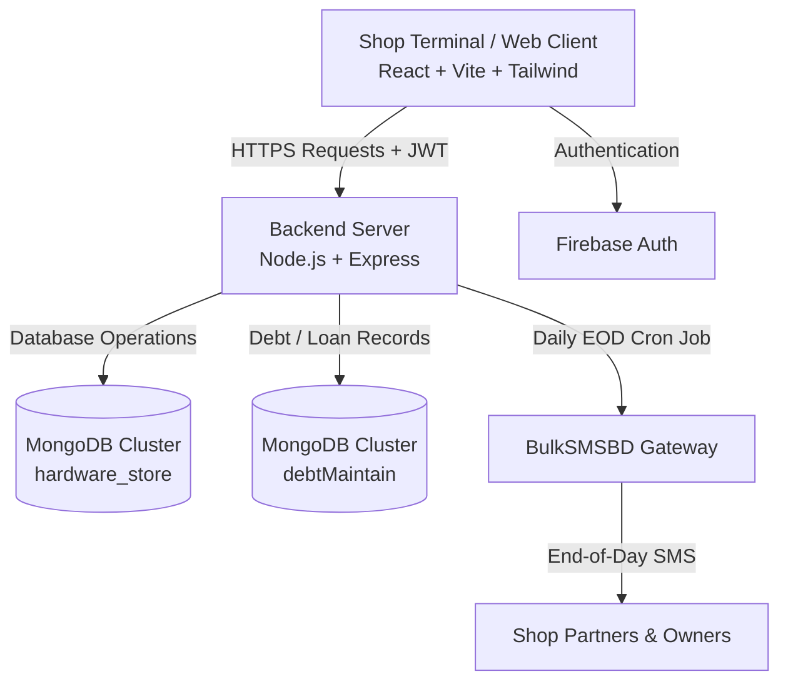

# 🛠️ Hardware Store Order & Inventory Management System (OMS)

[](https://reactjs.org/)
[](https://vitejs.dev/)
[](https://tailwindcss.com/)
[](https://daisyui.com/)
[](https://nodejs.org/)
[](https://expressjs.com/)
[](https://www.mongodb.com/)
[](https://firebase.google.com/)

An enterprise-grade **Order Management System (OMS)**, **Point of Sale (POS)**, and **Inventory Control Solution** tailored for retail and wholesale hardware, sanitary, electrical, and construction supply businesses.

Built with a modern full-stack architecture (**React + Vite + Express + MongoDB**), this platform simplifies daily transactions, ledger accounting, stock auditing, PDF invoice generation, and automated daily partner SMS reporting.

---

## 📑 Table of Contents

- [✨ Key Features](#-key-features)
- [🏗️ System Architecture](#️-system-architecture)
- [💻 Tech Stack](#-tech-stack)
- [📂 Project Directory Structure](#-project-directory-structure)
- [🗄️ Database Collections](#️-database-collections)
- [🚀 Quick Start & Installation](#-quick-start--installation)
  - [Prerequisites](#prerequisites)
  - [1. Clone Repository](#1-clone-repository)
  - [2. Server Configuration & Setup](#2-server-configuration--setup)
  - [3. Client Configuration & Setup](#3-client-configuration--setup)
- [🔐 Environment Variables](#-environment-variables)
- [📡 API Endpoints Overview](#-api-endpoints-overview)
- [⏰ Automated Cron Jobs & SMS Integration](#-automated-cron-jobs--sms-integration)
- [📱 Terminal / Device Access Control](#-terminal--device-access-control)
- [📜 Available Scripts](#-available-scripts)

---

## ✨ Key Features

### 🛒 1. Point of Sale (POS) & Sales Management
- **Fast Billing Interface**: Fast item selection via barcode scan, product ID, or smart search.
- **Dynamic Customer Tagging**: Select existing customers with live due balances or add new walk-in customers directly on checkout.
- **Flexible Payments**: Handles Cash, Due/Credit, and Advance payments with real-time balance calculations.
- **Profit Tracking**: Calculates item-level cost vs. sales profit automatically per invoice.
- **Printable Invoices**: Clean, printable PDF tax/sales invoices with store branding.

### 📦 2. Real-Time Inventory & Product Catalog
- **Multi-attribute Products**: Manage Products by Category, Brand, Unit (Pcs, Kg, Feet, Bag, Box, etc.), Purchase Price, and Retail Price.
- **Low Stock Alerts**: Real-time stock visibility and visual indicators for items nearing minimum threshold.
- **Stock Import/Export**: Support for exporting stock catalogs and inventory states to **Excel (`.xlsx`)**.

### 🚚 3. Procurement & Supplier Management
- **Purchase Orders & Stock In**: Record incoming vendor goods, update product stock counts, and recalculate weighted average costs.
- **Supplier Dues**: Track outstanding supplier payables and historical vendor invoices.
- **Purchase Vouchers**: Generate and print formatted purchase vouchers for supplier receipts.

### 👥 4. Customer & Supplier Double-Entry Ledgers
- **Customer Ledger**: Track lifetime purchase amounts, payments, returns, and current receivable balance.
- **Supplier Ledger**: Track supplier purchase totals, payments made, and pending payables.
- **Payment History**: Record partial payments with timestamps, payment methods, and updated balance histories.

### 📑 5. Quotation & Estimations Engine
- Create comprehensive price estimates and quotations for contractors, construction projects, and large buyers.
- Export clean, branded PDF quotations directly to clients before order confirmation.

### 💰 6. Accounts, Expenses & Cash Flow
- **Main Balance & Cash Drawer**: Real-time tracking of cash-in-hand and bank balances.
- **Expense Logging**: Categorized daily operational expenses (Staff salary, electricity, transport, maintenance, etc.).
- **Daily Financial Summary**: Opening balance, Cash Sales, Due Collections, Supplier Payments, Daily Expenses, Net Profit, and Closing Balance.

### 🔄 7. Trade Returns & Adjustments
- **Sales Return**: Return sold items back to inventory with automatic balance or customer due adjustments.
- **Purchase Return**: Return damaged/defective items back to vendors with ledger deductions.

### ⏰ 8. Automated EOD SMS Reports
- Scheduled **Cron Jobs** send a daily financial summary SMS every night to business partners' mobile numbers via **BulkSMSBD Gateway**.

### 🔒 9. Security & Device Restriction
- **Dual-Layer Authentication**: Firebase Authentication combined with JSON Web Token (JWT) authorization middleware.
- **Terminal Restriction**: Desktop-only access protection to restrict store transactions to designated PC/laptop workstations.

---

## 🏗️ System Architecture



---

## 💻 Tech Stack

### Frontend (`/client`)
| Technology | Description |
| :--- | :--- |
| **React 18** | Component-driven UI library |
| **Vite 5** | High-performance build tool and dev server |
| **React Router DOM 6** | Declarative client-side routing |
| **Tailwind CSS 3** | Utility-first styling framework |
| **DaisyUI 4** | Semantic UI components |
| **Firebase Auth** | User authentication service |
| **Axios** | HTTP client with secure interceptors |
| **jsPDF & html2canvas** | Client-side PDF generation & invoice printing |
| **XLSX** | Spreadsheet import & export |
| **React Icons & SweetAlert2** | Interactive icons and notification alerts |

### Backend (`/server`)
| Technology | Description |
| :--- | :--- |
| **Node.js** | JavaScript runtime environment |
| **Express.js 4** | Web application and REST API framework |
| **MongoDB Driver 6** | Official MongoDB database client |
| **JSONWebToken (JWT)** | Stateless authorization & route protection |
| **Node-Cron** | Task scheduling for automated daily summaries |
| **Date-Fns & Moment.js** | Date formatting and manipulation |
| **BulkSMSBD API** | Automated SMS gateway integration |

---

## 📂 Project Directory Structure

```plaintext
hardware-store/
├── .gitignore                    # Root gitignore rules
├── README.md                     # Project documentation
│
├── client/                       # Frontend React + Vite application
│   ├── .env.example              # Client environment template
│   ├── index.html                # Entry HTML document
│   ├── package.json              # Frontend dependencies and scripts
│   ├── postcss.config.js         # PostCSS configuration
│   ├── tailwind.config.js        # Tailwind CSS styling setup
│   ├── vite.config.js            # Vite build configuration
│   ├── public/                   # Static assets & favicon
│   └── src/
│       ├── AppRoute.jsx          # Route declarations & navigation tree
│       ├── main.jsx              # React app bootstrapping
│       ├── Provider.jsx          # Global Auth & Data Context Provider
│       ├── Root.jsx              # App layout with Sidebar & Header
│       ├── firebase.config.js    # Firebase initialization
│       ├── index.css             # Global Tailwind stylesheets
│       ├── assets/               # Images, brand logos, icons
│       ├── Components/           # Feature-based modular components
│       │   ├── AddProduct/       # Add / Edit product dialogs
│       │   ├── AddCategory/      # Category manager
│       │   ├── AddBrand/         # Brand manager
│       │   ├── AddUnit/          # Unit manager
│       │   ├── AddSupplier/      # Supplier creation modal
│       │   ├── AddCustomer/      # Customer creation modal
│       │   ├── CustomerLedger/   # Customer account ledgers
│       │   ├── SupplierLedger/   # Supplier account ledgers
│       │   ├── NewSale/          # POS Terminal billing interface
│       │   ├── NewPurchase/      # Goods inward / Purchase form
│       │   ├── NewQuotation/     # Estimate / Quotation creator
│       │   ├── currentStock/     # Real-time stock audit table
│       │   ├── PdfMaker/         # Printable PDF templates (Sales, Purchase, Quotation)
│       │   ├── Return/           # Trade returns (Sales & Purchase)
│       │   ├── Sidebar/          # Main navigation sidebar
│       │   ├── hooks/            # Custom Axios and secure request hooks
│       │   └── Protected/        # Auth & route guard wrappers
│       └── Pages/                # Top-level view pages
│           ├── Home.jsx          # Dashboard analytics & stats
│           ├── Sales.jsx         # Sales invoices ledger
│           ├── Purchase.jsx      # Purchase orders ledger
│           ├── Product.jsx       # Inventory & product catalog
│           ├── Customer.jsx      # Customer directory
│           ├── Supplier.jsx      # Supplier directory
│           ├── Expense.jsx       # Daily balance & costing
│           ├── Quotation.jsx     # Quotations list
│           └── DeviceRestriction.jsx # Terminal screen protector
│
└── server/                       # Backend Node.js Express server
    ├── .env.example              # Server environment template
    ├── index.js                  # Main server entry, routes & controllers
    ├── package.json              # Server dependencies and scripts
    └── utils/
        ├── cronJobs.js           # Automated end-of-day summary calculation
        └── sendSMS.js            # BulkSMSBD gateway client helper
```

---

## 🗄️ Database Collections

The backend interacts with two primary MongoDB databases:

### 1. `hardware_store` Database
- `productList`: Master product catalog with SKU, buy rate, sell rate, unit, stock count.
- `categoryList`: Product classifications.
- `brandList`: Registered manufacturers and brands.
- `unitList`: Units of measurement (Pcs, Kg, Feet, etc.).
- `salesInvoiceList`: Complete sales orders, items sold, totals, discounts, and payments.
- `purchaseInvoiceList`: Vendor purchase records, supplier info, and total costs.
- `customerList`: Customer contact details and account history.
- `customerDueList`: Receivable ledger balance and payment logs per customer.
- `supplierList`: Supplier contact details and billing addresses.
- `supplierDueList`: Payable ledger balance and payment logs per supplier.
- `quotationList`: Saved customer quotations and estimates.
- `stockList`: Current inventory level snapshots.
- `transactionList`: Expense logs and cash movement entries.
- `mainBalanceList`: Current store vault / cash-in-hand balance.
- `dailySummaryList`: Daily calculated sales, profits, dues, and closing balances.
- `returnSalesList` & `returnPurchaseList`: Records of returned goods and adjustments.

### 2. `debtMaintain` Database *(Optional / Associated)*
- `borrowerList` & `lenderList`: Tracks external debts and loans.
- `transactionList` & `lenderTransactionList`: Debt cash-in / cash-out records.

---

## 🚀 Quick Start & Installation

### Prerequisites
- [Node.js](https://nodejs.org/) (v18.x or higher)
- [MongoDB Atlas](https://www.mongodb.com/cloud/atlas) or a local MongoDB instance
- [Firebase Project](https://console.firebase.google.com/) for authentication
- [BulkSMSBD](https://bulksmsbd.net/) API account (optional for SMS features)

---

### 1. Clone Repository
```bash
git clone https://github.com/fuyadhasanfahim/hardware-shop.git
cd hardware-shop
```

---

### 2. Server Configuration & Setup

1. Navigate to the server folder:
   ```bash
   cd server
   ```

2. Install dependencies:
   ```bash
   npm install
   ```

3. Create environment file:
   ```bash
   cp .env.example .env
   ```

4. Populate `server/.env` with your credentials:
   ```env
   PORT=9000
   MONGO_URI=mongodb+srv://<username>:<password>@cluster0.mongodb.net/?retryWrites=true&w=majority
   TOKEN_SECRET=your_super_secret_jwt_token_key
   TIME=23:59
   PARTNERS=8801700000000,8801800000000
   SMS_API_KEY=your_bulksmsbd_api_key
   ```

5. Run the server in development mode:
   ```bash
   npm run dev
   ```
   Server will start at `http://localhost:9000`.

---

### 3. Client Configuration & Setup

1. Open a new terminal and navigate to the client folder:
   ```bash
   cd ../client
   ```

2. Install dependencies:
   ```bash
   npm install
   ```

3. Create client environment file:
   ```bash
   cp .env.example .env
   ```

4. Populate `client/.env` with your Firebase project keys:
   ```env
   VITE_APIKEY=AIzaSy...
   VITE_AUTHDOMAIN=your-app.firebaseapp.com
   VITE_PROJECTID=your-app
   VITE_STORAGEBUCKET=your-app.appspot.com
   VITE_MESSAGINGSENDERID=1234567890
   VITE_APPID=1:1234567890:web:...
   ```

5. Start the frontend development server:
   ```bash
   npm run dev
   ```
   Open your browser at `http://localhost:5173`.

---

## 🔐 Environment Variables

### Client (`client/.env`)
| Variable | Description |
| :--- | :--- |
| `VITE_APIKEY` | Firebase Web API Key |
| `VITE_AUTHDOMAIN` | Firebase Auth Domain |
| `VITE_PROJECTID` | Firebase Project ID |
| `VITE_STORAGEBUCKET` | Firebase Storage Bucket |
| `VITE_MESSAGINGSENDERID` | Firebase Cloud Messaging Sender ID |
| `VITE_APPID` | Firebase Application ID |

### Server (`server/.env`)
| Variable | Description |
| :--- | :--- |
| `PORT` | Port number for Express server (Default: `9000`) |
| `MONGO_URI` | MongoDB connection URI string |
| `TOKEN_SECRET` | Secret key for signing and verifying JWT tokens |
| `TIME` | Scheduled execution time for daily summary SMS (`HH:mm` format, e.g. `23:59`) |
| `PARTNERS` | Comma-separated Bangladeshi mobile numbers for EOD reports (e.g. `88017...,88018...`) |
| `SMS_API_KEY` | BulkSMSBD Gateway API Key |

---

## 📡 API Endpoints Overview

| Method | Endpoint | Description | Auth Required |
| :--- | :--- | :--- | :---: |
| `POST` | `/jwt` | Generate JWT access token | ❌ |
| `POST` | `/validate-token` | Validate JWT session token | ❌ |
| `GET` | `/products` | Fetch paginated product catalog | ✅ |
| `POST` | `/products` | Add a new product to inventory | ✅ |
| `PUT` | `/products/:id` | Update product details / pricing | ✅ |
| `POST` | `/sales` | Process a new sale & generate invoice | ✅ |
| `GET` | `/salesInvoiceList` | Retrieve all sales invoices | ✅ |
| `GET` | `/generateSalesInvoice` | Get single invoice data for printing | ✅ |
| `POST` | `/purchase` | Process new purchase & increment stock | ✅ |
| `GET` | `/purchaseInvoiceList` | Retrieve all purchase invoices | ✅ |
| `GET` | `/customerDueList` | Get all customer receivable ledgers | ✅ |
| `POST` | `/customerPayment` | Record customer due repayment | ✅ |
| `GET` | `/supplierDueList` | Get all supplier payable ledgers | ✅ |
| `POST` | `/supplierPayment` | Record supplier due payment | ✅ |
| `GET` | `/mainBalance` | Fetch current cash in vault / balance | ✅ |
| `POST` | `/addExpense` | Record daily business expense | ✅ |
| `POST` | `/tradeReturn` | Process sales/purchase trade return | ✅ |

---

## ⏰ Automated Cron Jobs & SMS Integration

The server features an automated background scheduler (`node-cron`) configured in [server/utils/cronJobs.js](file:///home/fuyad/Codes/Office/hardware-store/server/utils/cronJobs.js).

### Daily Report Structure
At the configured time (e.g., `23:59`), the system computes the day's financial metrics and delivers an SMS to all partner numbers:

```text
Mojumdar Hath Treders
Report: 14 Aug, 2026

Opening Balance: 154,200.00

--- CASH IN ---
Total Sales: 85,400.00
 - Cash Sales: 62,000.00
 - Due Sales: 23,400.00
Due Collection: 18,500.00
Loan Rcvd (In): 0.00

--- CASH OUT ---
Cash Purchase: 35,000.00
Supplier Paid: 12,000.00
Daily Expense: 3,200.00
Loan Given (Out): 0.00

--- OVERVIEW ---
Net Profit: 14,850.00
Today Net Cash: 30,300.00

Closing Balance: 184,500.00
```

---

## 📱 Terminal / Device Access Control

For business integrity and security, store staff access is protected by the `DeviceRestriction` layer ([DeviceRestriction.jsx](file:///home/fuyad/Codes/Office/hardware-store/client/src/Pages/DeviceRestriction.jsx)):
- Blocks unauthorized logins from mobile phones and tablets.
- Directs operations to authorized shop desktop/laptop computers with printer setups.

---

## 📜 Available Scripts

### Client
- `npm run dev`: Starts Vite dev server at `http://localhost:5173`
- `npm run build`: Bundles production assets into `client/dist`
- `npm run preview`: Previews production build locally
- `npm run lint`: Runs ESLint checks across JavaScript & JSX files

### Server
- `npm start`: Runs server using standard Node.js
- `npm run dev`: Runs server using `nodemon` for auto-reloading during development

---

## 📄 License & Attribution

Developed for **Mozumdarhat Traders (মজুমদারহাট ট্রেডার্স)**.  
All rights reserved. Proprietary business software.
